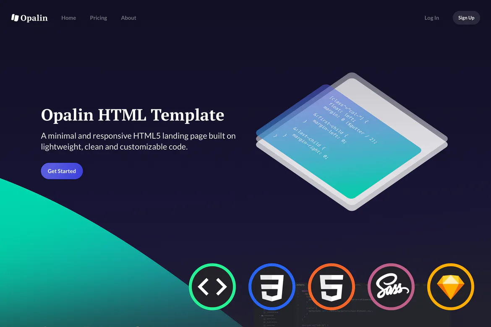

**Create a beautiful website for your startup with templates for pricing, about and onboarding pages.** Opalin HTML Template is built on a custom framework making it light and super fast. It’s available in HTML, CSS and well-organized Sass files. In addition, the HTML template is also available in Sketch with responsive and nested symbols.

 - **Custom framework:** With a custom framework, simple grid and global classes, build consistent pages with ease.
 - **Sass:** Available in CSS but also shipped with well-organized Sass files.
 - **Typography:** Effortlessly create bold and beautiful pages.
 - **Sketch:** 100% of the landing page, including all modules and components have been designed in Sketch.
 - **8-point grid:** Everything is following a consistent grid to help maintain a quality rhythm between elements.
 - **Icons:** This template is using the material icons by Google. Best of all, you can easily download SVGs from their online library.

The code doesn’t rely on any third party framework or tool. Everything is neatly organized in Sass and has been heavily focused on performances. And if you’re not used to Sass, no worries, plain CSS is also available.

100% of the landing page, including all modules and components have been designed in Sketch. It’s a great addition that will help you save time and work more effectively with the power of nested symbols, organized typography and shared styles.

Easily copy sections around to create your own pages or customize the existing ones. The template is delivered with pages for home, about and pricing. Additional onboarding pages to log in, sign up as well as forgot password are included.

-------------------------------------------------------------------------------

This template has been ported to DynamicalWeb by Zi Xing Narrakas